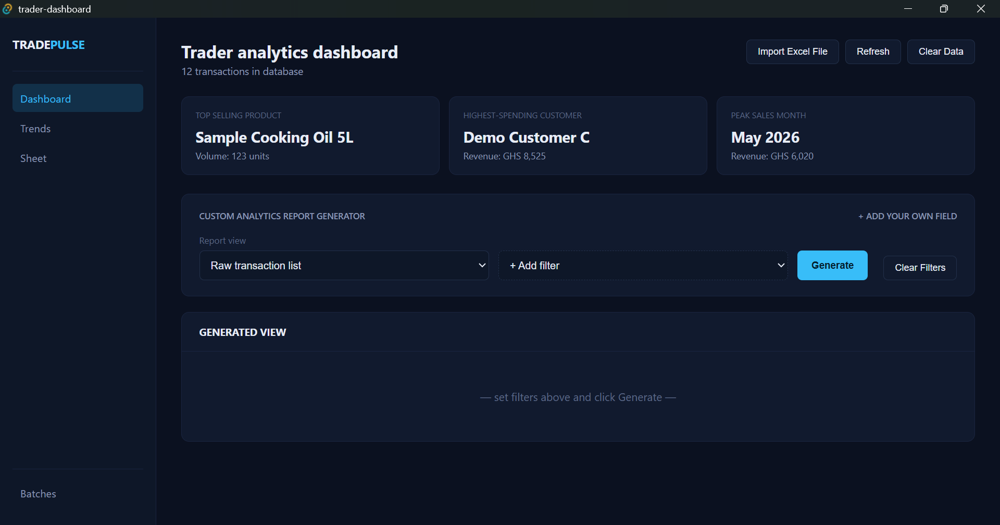
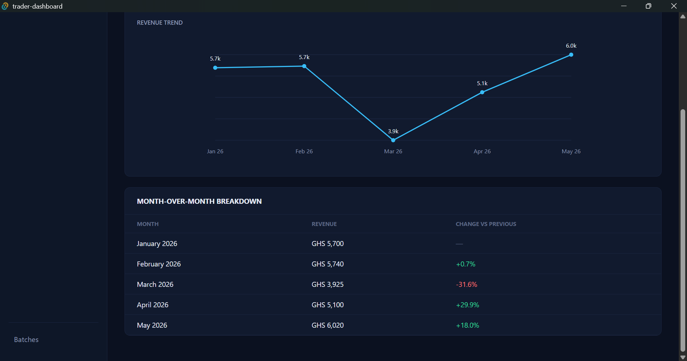
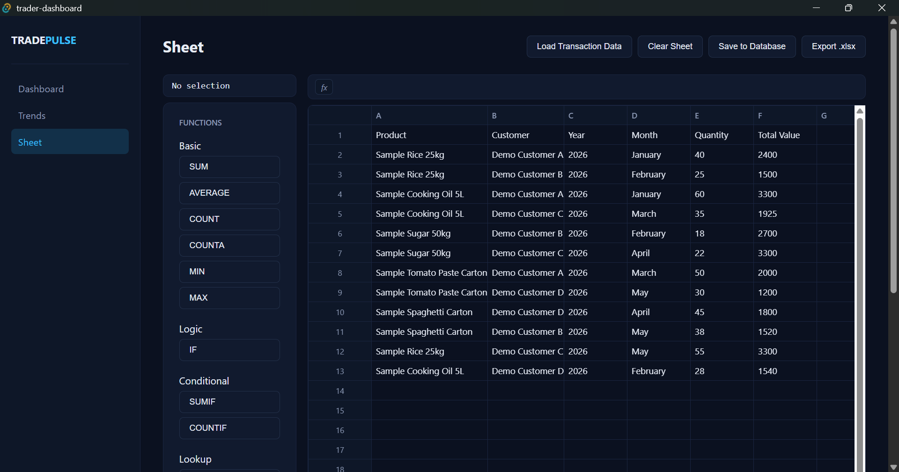
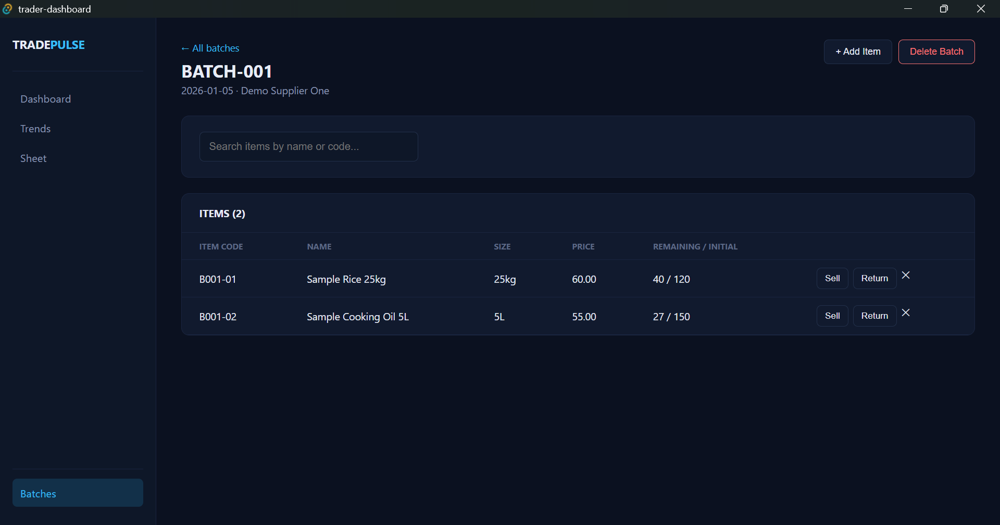

# TRADEPULSE

**A local-first desktop app for tracking sales, analysing trader performance, managing stock batches, and crunching numbers in a built-in spreadsheet.**

TRADEPULSE is built with [Tauri](https://tauri.app/) (Rust backend), React + TypeScript (frontend), and SQLite (storage). All data lives in a single database file on your machine. There is no server, no account, and no internet requirement.

---

## Table of Contents

1. [Overview](#overview)
2. [Screenshots](#screenshots)
3. [Feature Tour](#feature-tour)
   - [Dashboard](#1-dashboard)
   - [Custom Fields](#2-custom-fields)
   - [Excel Import](#3-excel-import)
   - [Trends](#4-trends)
   - [Sheet](#5-sheet-built-in-spreadsheet)
   - [Batches](#6-batches-inventory-tracking)
3. [Tech Stack](#tech-stack)
4. [Architecture](#architecture)
5. [Project Structure](#project-structure)
6. [Database Schema](#database-schema)
7. [Tauri Command Reference](#tauri-command-reference)
8. [Getting Started](#getting-started)
9. [Usage Guide](#usage-guide)
10. [Keyboard Shortcuts](#keyboard-shortcuts-sheet)
11. [Data Model Notes and Design Decisions](#data-model-notes-and-design-decisions)
12. [Known Limitations](#known-limitations)
13. [Roadmap Ideas](#roadmap-ideas)
14. [Contributing](#contributing)
15. [License](#license)

---

## Overview

TRADEPULSE is aimed at small traders and shop owners who keep their sales records in Excel and want something better than scrolling through rows. It lets you:

- **Import** existing sales spreadsheets (`.xlsx`) with a flexible column mapper.
- **Analyse** sales by product, customer, month, year, or any custom field you define.
- **Edit** records in place, add new ones, delete old ones, and export any report back to Excel.
- **Watch trends** with month-over-month revenue growth and a live chart.
- **Work in a spreadsheet** (with formulas such as `SUM`, `IF`, `VLOOKUP`, `XLOOKUP`) directly on top of your transaction data, then save the result back to the database.
- **Track stock in batches**, with traceable item codes, sales and returns that automatically adjust remaining quantity, and each sale recorded in your transaction history.

Currency is displayed as **GHS** (Ghana cedis) by default.

---

## Screenshots

### Dashboard
Headline metrics plus the custom report generator, with filters, report views, inline editing and Excel export.



### Trends
Month-over-month revenue chart and breakdown table, with growth and decline colour-coded.



### Sheet
The built-in spreadsheet with the function panel, name box, formula bar and transaction data loaded.



### Batches
Batch detail view with item search, remaining and initial stock, and Sell, Return and delete actions per item.



---

## Feature Tour

The app has a left sidebar with four views: **Dashboard**, **Trends**, **Sheet**, and (pinned at the bottom) **Batches**.

### 1. Dashboard

The Dashboard is the main working area.

**Header actions**

| Button | What it does |
| --- | --- |
| Import Excel File | Opens a file picker for `.xlsx` files and starts the import flow |
| Refresh | Reloads all transactions from the database |
| Clear Data | Permanently deletes **all** transactions (asks for confirmation first) |

**Headline metric cards** (shown once there is data)

- **Top selling product** by total units sold.
- **Highest-spending customer** by total revenue.
- **Peak sales month** (month and year combined) by revenue.

**Custom analytics report generator**

Build a report in three steps:

1. **Add filters.** Use the *+ Add filter* dropdown to add any of: Product, Customer, Year, Month, or any custom field you have created. Each filter becomes a dropdown populated with the distinct values found in your data (plus an "All" option). Filters can be removed individually.
2. **Pick a report view:**

   | View | Output |
   | --- | --- |
   | **Raw transaction list** | Every matching transaction, sorted by total value (highest first), including custom field columns |
   | **None (only selected filters)** | Only the columns you have added as filters, one row per matching transaction |
   | **Most purchased products** | Products ranked by units sold, with total value |
   | **Customers by total spend** | Customers ranked by revenue, with total units |
   | **Sales by month** | Revenue per month-year, ranked highest first |

3. **Click Generate.** Results appear in the table below.

**Working with generated results**

- **Click a column header to sort** (ascending, then descending). Numeric columns sort numerically, and a ▲/▼ indicator shows the active sort.
- **Automatic TOTAL row.** Numeric columns (quantity, total value, year, number-type custom fields, depending on the view) are summed in a footer row. In edit mode the totals update live as you type.
- **Edit Data mode** (available on *Raw transaction list* and *None* views, since those map back to real database rows):
  - Edit cells inline. Product and Customer cells offer autocomplete suggestions from existing data, Month is a dropdown, and numeric cells are hard-locked so only digits, one decimal point, and a leading minus can be typed.
  - **+ Add Row** (Raw transaction list only) appends a blank row, with the year defaulting to the current year. Rows with no content are ignored on save.
  - **✕** deletes a row. Unsaved rows are simply dropped. Saved rows ask for confirmation, then are permanently deleted from the database.
  - **Done Editing** validates numbers, then saves changes in batch (updates and inserts in one pass) and reloads data.
  - Only the columns shown in the current view are overwritten, so fields not displayed stay untouched.
- **Export .xlsx** writes the current view (including the TOTAL row) to an Excel file you choose. Numeric columns are written as real numbers, not text.

### 2. Custom Fields

Click **+ Add your own field** in the report generator panel to extend the data model without touching the database schema.

- Give the field a **name** (for example `Region`, `Salesperson`) and a **type** (`text` or `number`).
- Custom fields become available as filters, as columns in the raw list view, and as targets in the import and sheet-save mappers.
- Values are stored per transaction in a JSON `extra` column.
- Text-type custom fields get autocomplete suggestions while editing. Number-type fields get the numeric input lock and are included in totals.
- Removing a field (✕ on its chip) removes it from filters and forms, but **saved values remain in the database**. Re-adding a field with the same name brings them back.

### 3. Excel Import

Click **Import Excel File** and choose an `.xlsx` file. The first sheet is read, and row 1 is treated as headers.

- **Fast path:** if the file's headers are exactly the six standard ones (Product, Customer, Year, Month, Quantity, Total Value, in any order, case-insensitive), it imports immediately.
- **Column mapper:** otherwise a modal lets you map every spreadsheet column to one of: Product, Customer, Year, Month, Quantity, Total Value, **Custom field**, or **Skip**.
  - Columns are pre-guessed from their header names. Unrecognised columns default to custom fields (reusing an existing custom field's name and type when it matches).
  - Each of the six required roles must be mapped to **exactly one** column.
  - Custom columns need unique, non-empty names, and you choose `text` or `number` for each.
  - Mappings are keyed by column *position*, so spreadsheets with duplicate header labels work correctly.
- **Parsing is forgiving:** numbers may be formatted with currency symbols or thousands separators, and values in parentheses like `(1,200)` are read as negatives. Rows with an empty product are skipped.
- The whole import runs in **one database transaction**, so a failure part-way leaves nothing half-imported.

### 4. Trends

The **Trends** view answers "how is revenue changing month to month?"

- Revenue is aggregated by month and year across all transactions and sorted chronologically.
- **Three summary cards:** latest month, previous month, and percentage change versus last month (green for growth, red for decline).
- **Revenue trend chart:** a hand-built SVG line chart with labelled points (compact `k`/`M` formatting), grid lines, and hover tooltips with exact values. At least two months of data are needed.
- **Month-over-month breakdown table** listing every month's revenue and its percentage change versus the previous one.

### 5. Sheet (Built-in Spreadsheet)

A lightweight, Excel-style grid (starts at 30 rows × 10 columns, expandable) designed for ad-hoc calculation on your data.

**Grid interactions**

- Click, shift-click, and click-drag to select cells or ranges. Click column or row headers to select entire columns or rows (drag to extend). Click the corner to select all.
- Double-click a cell, press `Enter` or `F2`, or just start typing to edit.
- **Name box** (top left): type a cell or range such as `G10` or `G1:H1` and press `Enter` to jump to it.
- **Formula bar** shows the selected cell's formula (for example `=SUM(B2:B20)`) or raw value.
- **Insert rows and columns** using the **+** buttons that appear when hovering a row or column header. Existing formulas are automatically shifted so their references stay correct.
- **Copy, cut, paste** within the sheet, with **undo and redo**.
- Formula results are shown in green.

**Function wizard**

Rather than typing formulas, you build them step by step. Click a function in the left panel, and the wizard prompts you for each argument. For range and cell arguments you select directly on the sheet. For text arguments you type a value. Finally you click the cell where the result should go.

| Category | Functions |
| --- | --- |
| Basic | `SUM`, `AVERAGE`, `COUNT`, `COUNTA`, `MIN`, `MAX` |
| Logic | `IF` (cell, operator `=`, `>`, `<`, `>=`, `<=`, `<>`, compare value, value if true, value if false) |
| Conditional | `SUMIF`, `COUNTIF` |
| Lookup | `VLOOKUP`, `XLOOKUP` |

Formulas store *references*, not frozen values, so results **recalculate live** as the cells they depend on change. Formulas can depend on other formulas, with **circular-reference protection** (shows `#CIRCULAR!`). Failed lookups return `#N/A`, and invalid input returns descriptive errors.

**Connecting the sheet to your database**

| Button | What it does |
| --- | --- |
| Load Transaction Data | Fills the sheet with a header row plus every transaction, remembering which row maps to which database record |
| Save to Database | Treats row 1 as headers, opens the column mapper, then **updates** rows that came from existing transactions and **inserts** new rows |
| Export .xlsx | Exports the used range of the sheet. Numeric columns are auto-detected |
| Clear Sheet | Wipes the grid after confirmation |

When saving, evaluated formula results (not formula text) are what get stored. Rows with an empty Product are skipped.

### 6. Batches (Inventory Tracking)

The **Batches** view tracks goods you receive from suppliers and ties each sale back to the exact batch and item it came from.

- **Create a batch** with a batch number (must be unique), date received, supplier, and one or more items (name, size, price, quantity).
- Every item automatically gets a **traceable item code** of the form `NAME-BATCHNUMBER-SEQ`, for example `SNEA-B2024-01-003`. The prefix is the first four letters or digits of the item name, uppercased (`ITEM` if none), followed by the batch number and the item's position within the batch.
- The batch list shows batch number, date, supplier, item count, and total units still in stock.
- Open a batch to manage its items and record sales and returns. The backend supports:
  - **Recording a sale:** reduces `quantity_remaining`, and refuses if you try to sell more than is in stock.
  - **Recording a return:** increases `quantity_remaining`, and refuses to exceed the original batch quantity.
  - Each sale or return also writes a row into the main `transactions` table (product shown as `Name (Size)`, returns stored as negative quantity and negative value), so Dashboard, Trends, and the Sheet reflect batch activity automatically.
  - **Adding items** to an existing batch (the next sequence number is assigned automatically).
  - **Deleting an item.**
  - **Deleting a batch**, which requires typing the batch number to confirm. Sales history is preserved: existing transactions are detached from the batch rather than deleted.

---

## Tech Stack

| Layer | Technology |
| --- | --- |
| Desktop shell | Tauri 2 (with `tauri-plugin-dialog` for native open/save dialogs) |
| Frontend | React (hooks), TypeScript |
| Styling | Handwritten CSS embedded in components, dark theme |
| Backend | Rust |
| Database | SQLite via `rusqlite` |
| Excel read | `calamine` (`.xlsx` parsing) |
| Excel write | `rust_xlsxwriter` |
| Serialization | `serde`, `serde_json` |

No charting library is used. The trend chart is plain SVG.

---

## Architecture

```
┌──────────────────────────────┐        invoke("command", args)       ┌──────────────────────────────┐
│  React + TypeScript (UI)     │ ───────────────────────────────────▶ │  Rust (Tauri commands)       │
│                              │                                      │                              │
│  App.tsx   (Dashboard,       │ ◀─────────────────────────────────── │  AppState { db: Mutex<Conn> }│
│            Trends, shell)    │            JSON results / errors     │  rusqlite · calamine ·       │
│  Sheet.tsx                   │                                      │  rust_xlsxwriter             │
│  Batches.tsx / BatchDetail   │                                      └──────────────┬───────────────┘
└──────────────────────────────┘                                                     │
                                                                                     ▼
                                                                    <app_data_dir>/trader.db (SQLite)
```

Key points:

- **All data access goes through Tauri commands.** The frontend never touches the database directly.
- **A single SQLite connection** is held in managed state behind a `Mutex`.
- **Multi-row writes are transactional** (`import_excel`, `add_transactions`, `update_transactions`, `create_batch`, `record_batch_sale`, `delete_batch`, and others), so they either fully succeed or fully roll back.
- **Schema migrations are idempotent.** On every startup the app creates missing tables, attempts `ALTER TABLE ... ADD COLUMN` (harmlessly ignored if the column exists), and runs a one-time-safe backfill.
- **Reports are computed client-side** from the loaded transaction list, which keeps filtering and re-sorting instant.
- **Spreadsheet formulas** are stored as structured specs (function name plus argument references) and evaluated by a small recursive resolver with caching and cycle detection.

---

## Project Structure

> File names below are based on the source imports. Adjust to match your repository.

```
tradepulse/
├── src/
│   ├── App.tsx                    # Shell, sidebar, Dashboard, Trends, import mapper
│   ├── Sheet.tsx                  # Spreadsheet grid, function wizard, save/export
│   ├── Batches.tsx                # Batch list and "new batch" form
│   ├── BatchDetail.tsx            # Single batch: items, sales, returns, delete
│   ├── importMapping.ts           # guessRole, STANDARD_HEADER_NAMES, STANDARD_ROLE_OPTIONS, ImportMapping
│   ├── types.ts                   # Transaction, CustomField types
│   └── hooks/
│       ├── useKeyboardShortcuts.ts  # Reusable window-level shortcut registration
│       └── useUndoRedo.ts           # Snapshot-based undo/redo for the sheet
├── src-tauri/
│   ├── src/
│   │   └── lib.rs                 # DB init/migrations + all Tauri commands
│   ├── Cargo.toml
│   └── tauri.conf.json
├── package.json
└── README.md
```

---

## Database Schema

The database file is named `trader.db` and is stored in the OS-specific Tauri **app data directory**.

### `transactions`

| Column | Type | Notes |
| --- | --- | --- |
| `id` | INTEGER PK AUTOINCREMENT | |
| `product` | TEXT NOT NULL | Free-text product name |
| `customer` | TEXT NOT NULL | |
| `year` | INTEGER NOT NULL | |
| `month` | TEXT NOT NULL | Month name, e.g. `March` |
| `quantity` | INTEGER NOT NULL | Negative for batch returns |
| `total_value` | REAL NOT NULL | Negative for batch returns |
| `extra` | TEXT DEFAULT `'{}'` | JSON object holding custom field values |
| `product_id` | INTEGER → `products(id)` | Added by migration and backfilled for older rows |
| `batch_id` | INTEGER → `batches(id)` | Set for sales recorded from a batch |
| `batch_item_id` | INTEGER → `batch_items(id)` | Set for sales recorded from a batch |

### `custom_fields`

| Column | Type | Notes |
| --- | --- | --- |
| `name` | TEXT PK | |
| `field_type` | TEXT NOT NULL | `text` or `number` |

### `products`

| Column | Type | Notes |
| --- | --- | --- |
| `id` | INTEGER PK AUTOINCREMENT | |
| `name` | TEXT NOT NULL | |
| `item_type` | TEXT NOT NULL DEFAULT `''` | |
| `size` | TEXT NOT NULL DEFAULT `''` | |
| | `UNIQUE(name, item_type, size)` | |

### `batches`

| Column | Type | Notes |
| --- | --- | --- |
| `id` | INTEGER PK AUTOINCREMENT | |
| `batch_number` | TEXT NOT NULL UNIQUE | |
| `batch_date` | TEXT | |
| `supplier` | TEXT | |

### `batch_items`

| Column | Type | Notes |
| --- | --- | --- |
| `id` | INTEGER PK AUTOINCREMENT | |
| `batch_id` | INTEGER NOT NULL → `batches(id)` | |
| `seq_in_batch` | INTEGER NOT NULL | Position within the batch |
| `item_code` | TEXT NOT NULL UNIQUE | e.g. `SNEA-B2024-01-003` |
| `name` | TEXT NOT NULL | |
| `size` | TEXT NOT NULL DEFAULT `''` | |
| `price` | REAL NOT NULL | Unit price used for sales |
| `initial_quantity` | INTEGER NOT NULL | |
| `quantity_remaining` | INTEGER NOT NULL | |

---

## Tauri Command Reference

All commands are exposed to the frontend via `invoke(...)` and registered in `lib.rs`.

### Transactions

| Command | Purpose |
| --- | --- |
| `get_transactions` | Return all transactions |
| `add_transactions` | Insert many rows in one DB transaction (skips empty-product rows) |
| `update_transactions` | Update many rows by `id` (rejects empty product) |
| `delete_transaction` | Delete one row by `id` |
| `clear_data` | Delete every transaction |

### Custom fields

| Command | Purpose |
| --- | --- |
| `get_custom_fields` | List fields in creation order |
| `add_custom_field` | Create a field (ignored if the name exists) |
| `remove_custom_field` | Delete the field definition (stored values remain) |

### Excel

| Command | Purpose |
| --- | --- |
| `get_excel_headers` | Read row 1 of the first sheet |
| `import_excel` | Import using a column-role mapping, all in one DB transaction |
| `export_report` | Write columns and rows to `.xlsx`, with numeric columns stored as numbers |

### Batches

| Command | Purpose |
| --- | --- |
| `create_batch` | Create a batch and its items atomically |
| `get_batches` | Batch summaries with item count and units remaining |
| `get_batch` | One batch's details |
| `get_batch_items` | Items in a batch, ordered by sequence |
| `add_batch_item` | Append an item with the next sequence number |
| `delete_batch_item` | Remove an item |
| `record_batch_sale` | Record a sale or return, update stock, and write a transaction |
| `delete_batch` | Delete a batch (requires typing the batch number) and detach its transactions |

### Misc

| Command | Purpose |
| --- | --- |
| `greet` | Leftover Tauri template command |

---

## Getting Started

### Prerequisites

- [Node.js](https://nodejs.org/) (LTS recommended) and npm
- [Rust](https://www.rust-lang.org/tools/install) (stable toolchain)
- The platform-specific [Tauri 2 prerequisites](https://tauri.app/start/prerequisites/) (for example, WebView2 on Windows, WebKitGTK and build tools on Linux, Xcode command line tools on macOS)

### Install and run (development)

```bash
# 1. Clone the repository
git clone https://github.com/alfredx777/tradepulse-dashboard
cd tradepulse-dashboard

# 2. Install frontend dependencies
npm install

# 3. Launch the desktop app with hot reload
npm run tauri dev
```

The first run compiles the Rust backend, which can take a few minutes. Subsequent runs are much faster.

### Build a production installer

```bash
npm run tauri build
```

Installers and binaries are written to `src-tauri/target/release/bundle/`.

### Where is my data stored?

`trader.db` lives in Tauri's per-app data directory. Typical locations (the folder name follows your app's bundle identifier):

| OS | Typical path |
| --- | --- |
| Windows | `%APPDATA%\<identifier>\trader.db` |
| macOS | `~/Library/Application Support/<identifier>/trader.db` |
| Linux | `~/.local/share/<identifier>/trader.db` |

**Backing up** is as simple as copying that file while the app is closed.

---

## Usage Guide

### Quick start: get your data in

1. Open **Dashboard** and click **Import Excel File**.
2. Choose your `.xlsx` file. If the headers match the six standard names, it imports instantly. Otherwise map the columns in the dialog and click **Import**.
3. The subtitle updates to show how many transactions are in the database.

### Find your best customers in a given year

1. Click **+ Add filter** and choose **Year**, then pick the year.
2. Set **Report view** to *Customers by total spend*.
3. Click **Generate**, sort by clicking headers, and **Export .xlsx** if you want to share it.

### Fix a typo in old records

1. Generate the *Raw transaction list* (optionally filtered).
2. Click **Edit Data**, correct the cells, and click **Done Editing**.

### Add a new column of your own (for example, Region)

1. Click **+ Add your own field**, enter `Region`, choose `text`, and click **Add field**.
2. It now appears as a filter option and as a column in the raw list. Fill it in via **Edit Data**, or include it when importing.

### Analyse with formulas

1. Go to **Sheet** and click **Load Transaction Data**.
2. Click a function (for example `SUMIF`) and follow the prompts: select the sum range, then the criteria range, type the criteria, and finally click the result cell.
3. When finished, **Save to Database** to push edits back, or **Export .xlsx** to share.

### Track a shipment

1. Go to **Batches**, click **+ New Batch**, and enter the batch number, date, supplier, and items.
2. Open the batch to record sales and returns. Each one adjusts stock and appears in your Dashboard and Trends data.

---

## Keyboard Shortcuts (Sheet)

Shortcuts apply on the Sheet view and are ignored while typing in an input (except `Escape`). `Ctrl` also works as `Cmd` on macOS.

| Shortcut | Action |
| --- | --- |
| Arrow keys | Move selection |
| `Shift` + Arrow keys | Extend selection |
| `Tab` / `Shift+Tab` | Move right / left (wraps across rows) |
| `Enter` or `F2` | Edit the selected cell |
| Typing any character | Start editing the selected cell, replacing its content |
| `Delete` / `Backspace` | Clear the selection |
| `Escape` | Cancel the function wizard (or cancel a cell edit) |
| `Ctrl+C` / `Ctrl+X` / `Ctrl+V` | Copy / cut / paste |
| `Ctrl+Z` / `Ctrl+Y` | Undo / redo |
| `Ctrl+S` | Open **Save to Database** |

Shortcuts are registered through a reusable `useKeyboardShortcuts(defs, enabled)` hook, so other views can adopt them with a different set of definitions.

---

## Data Model Notes and Design Decisions

- **Custom fields as JSON.** Storing them in an `extra` column avoids schema migrations every time a user adds a field. The trade-off is that filtering on them happens in the frontend rather than in SQL.
- **Non-destructive field removal.** Deleting a custom field definition keeps stored values so accidental removals are recoverable.
- **Signed quantities for returns.** A return is a negative-quantity, negative-value transaction, so totals and trends net out automatically without special-case logic.
- **History over cleanliness on delete.** Deleting a batch detaches its transactions instead of removing them, because real sales history shouldn't vanish when inventory bookkeeping changes.
- **Confirmation friction scales with risk.** Clearing data and deleting rows use a confirm dialog, while deleting a batch requires typing its number.
- **Idempotent startup migrations.** Older databases upgrade themselves automatically. Failed `ALTER TABLE` calls on existing columns are intentionally ignored.
- **Position-keyed import mappings.** Column mappings are keyed by index, not header text, so duplicate or blank header names can't collide.

---

## Known Limitations

These are worth knowing about, and good candidates for future work:

- **Sheet state is not persisted.** Cells and formulas live in component state, so switching to another view or closing the app discards them unless you used **Save to Database** or **Export**. Only values are saved, never formula definitions.
- **Batch stock and transactions aren't reconciled on edit or delete.** Editing or deleting a batch-originated transaction from the Dashboard, or running **Clear Data**, does not adjust `quantity_remaining`.
- **Deleting a batch item** does not detach any transactions that reference it.
- **Product normalisation is partial.** The `products` table is backfilled for existing rows at startup, but newly added transactions don't automatically get a `product_id`.
- **Import always appends.** There is no duplicate detection, so importing the same file twice creates duplicate transactions.
- **Only the first worksheet** of an Excel file is read.
- **Currency is fixed to GHS** in the UI formatting.
- **No ordering guarantee** on the raw transaction query beyond what the UI sorts.
- **Large datasets:** reports, filters, and the sheet are computed in the browser, so extremely large databases may feel slower.
- **Native `alert` / `confirm` dialogs** are used for feedback.
- **No automated tests** are included yet.

---

## Roadmap Ideas

- Persist sheet contents and formulas
- Duplicate detection and "replace instead of append" on import
- Configurable currency and locale
- Charts for the report views (products, customers) and date-range filters
- Reconcile batch stock when transactions are edited or deleted
- Low-stock alerts and batch-level profit and margin reports
- Backup and restore from within the app
- CSV import and export
- Unit tests for formula evaluation, parsing helpers, and Rust commands
- Replace native alerts with in-app toasts and modals

---

## Contributing

Contributions, bug reports, and ideas are welcome.

1. Fork the repo and create a feature branch.
2. Keep changes focused and small, and test the affected flows via `npm run tauri dev`.
3. Open a pull request describing what changed and why.
